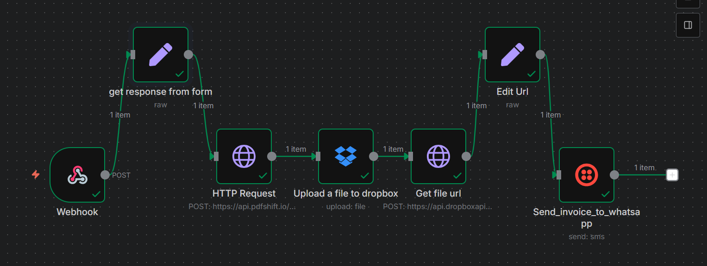
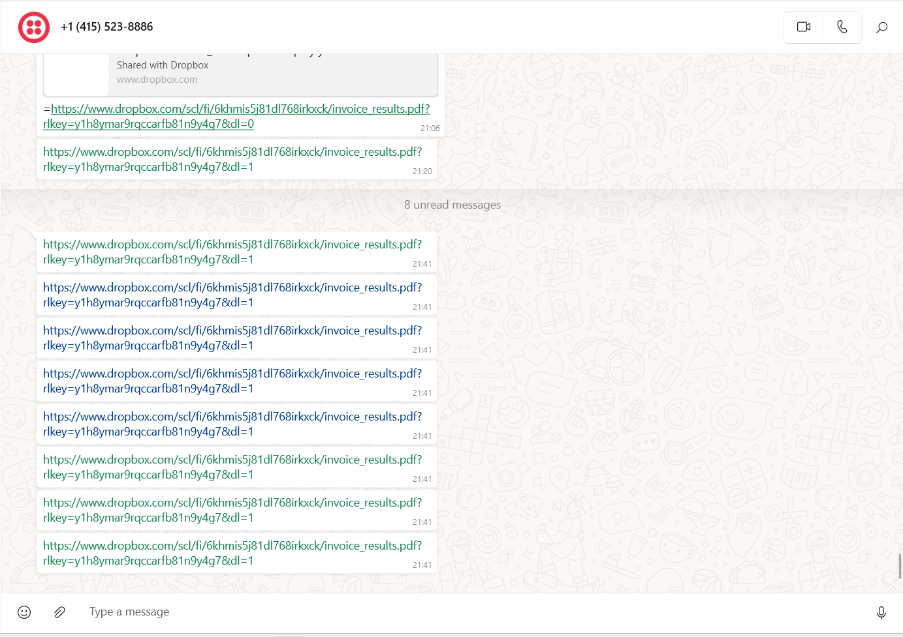
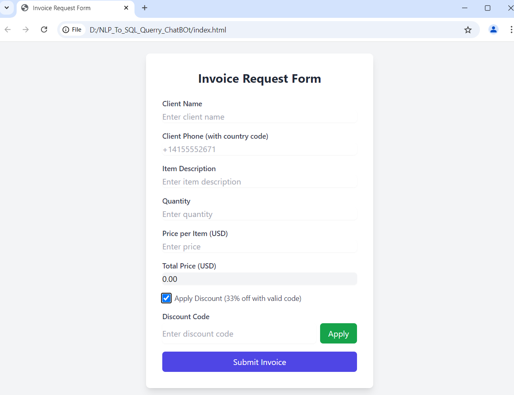

# Invoice Generator with n8n, Dropbox, and WhatsApp

This project allows you to submit invoice details via a simple web form and receive a **PDF invoice** directly on **WhatsApp**.  
It uses **n8n**, **Dropbox**, and **Twilio WhatsApp API**.

---

## 🚀 Features
- HTML form hosted on Netlify for invoice submission
- n8n workflow to:
  1. Receive form data via Webhook
  2. Generate PDF invoice from HTML template using PDFShift API
  3. Upload PDF to Dropbox
  4. Create a direct download link
  5. Send the PDF to WhatsApp via Twilio
- Fully automated end-to-end

---

## 🛠️ Tech Stack
- **Frontend**: HTML + Tailwind CSS (Formspree or direct POST to n8n webhook)
- **Automation**: [n8n](https://n8n.io/)
- **PDF Generation**: [PDFShift API](https://pdfshift.io/)
- **File Storage**: Dropbox API
- **Messaging**: Twilio WhatsApp API

---

## 📦 Installation & Setup

### 1️⃣ Clone the Repository
```bash
git clone https://github.com/Ahmadraza880/invoice-generator-whatsapp.git
cd invoice-generator-whatsapp
```

### 2️⃣ Setup the HTML Form
- Go to the `form/` folder → edit `index.html`
- Update the `action` attribute with your **n8n webhook URL**
- Deploy the form to [Netlify](https://www.netlify.com/) or any static hosting service

---

### 3️⃣ Configure n8n Workflow
1. Import `n8n-workflow/invoice-generator.json` into your n8n instance
2. Update **credentials**:
   - **PDFShift API Key**
   - **Dropbox OAuth**
   - **Twilio SID & Auth Token**
3. Save & Activate the workflow

---

### 4️⃣ How the Workflow Works
1. **Webhook Node** — receives form submission
2. **Set Node** — generates HTML invoice
3. **HTTP Request Node** — sends HTML to PDFShift to create PDF
4. **Dropbox Upload Node** — saves PDF in `/Invoices/`
5. **Dropbox Create Shared Link Node** — generates direct download link
6. **Set Node** — modifies URL to `?dl=1` for direct download
7. **Twilio Node** — sends PDF link to client via WhatsApp

---

## 📷 Screenshots

### 🖼️ Workflow


### 🖼️ WhatsApp Message


### 🖼️ Invoice Form


---

## 📄 Example `.env` for Local n8n
```env
N8N_HOST=localhost
N8N_PORT=5678
N8N_PROTOCOL=http
```

---

## 🔑 API Keys Needed
- **PDFShift** – [Get API Key](https://pdfshift.io/)
- **Dropbox** – Create App, enable `files.content.write` scope
- **Twilio** – Create WhatsApp Sender

---

## 📜 License
This project is open-source under the MIT License.

---

## 🌐 Connect With Me
- **LinkedIn**: [Your LinkedIn Profile](www.linkedin.com/in/ahmad-raza-403bbd0278)
- **Fiverr**: [Your Fiverr Profile](https://www.fiverr.com/users/nitrola/)

